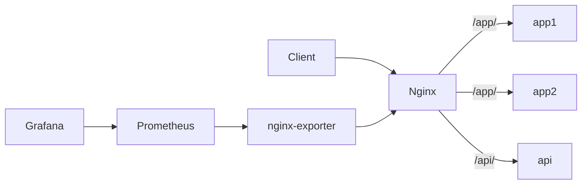

# Nginx Docker Lab

Une plateforme Nginx complete, propre et documentee pour apprendre, deployer et faire evoluer un reverse proxy moderne sous Docker.

## Objectifs

Ce projet fournit une implementation professionnelle de Nginx conteneurise avec :

- reverse proxy HTTP et HTTPS
- terminaison TLS
- redirection HTTP vers HTTPS
- multi-sites et virtual hosts
- load balancing entre plusieurs backends
- proxy vers API interne
- cache proxy
- rate limiting
- zone protegee par authentification Basic Auth
- en-tetes de securite
- compression gzip
- healthcheck
- logs Nginx
- endpoint `stub_status`
- observabilite optionnelle avec Prometheus et Grafana
- profil Certbot pour les certificats Let's Encrypt
- separation reseau entre exposition, applicatif et observabilite
- durcissement Docker de base des conteneurs

## Architecture

```text
Internet / Client
        |
        v
+-------------------+
|       Nginx       |
| 80 / 443 exposed  |
+-------------------+
   |      |      |
   |      |      +--> site statique secondaire
   |      |
   |      +---------> API echo proxifiee
   |
   +---------------> upstream load-balanced
                     |-> app1
                     |-> app2

Observability profile:
Nginx -> nginx-exporter -> Prometheus -> Grafana
```

### Schema d'architecture detaille

Un schema plus lisible et plus complet est disponible dans [docs/ARCHITECTURE.md](/root/Nginx/docs/ARCHITECTURE.md:1).



## Arborescence

```text
.
|-- .env.example
|-- docker-compose.yml
|-- Makefile
|-- nginx/
|   |-- nginx.conf
|   |-- snippets/
|   `-- templates/
|-- scripts/
|-- sites/
|   |-- landing/
|   `-- static/
|-- prometheus/
`-- grafana/
```

## Demarrage rapide

### 1. Preparer l'environnement

```bash
cp .env.example .env
chmod +x scripts/*.sh
make init
```

Le script `make init` genere :

- deux certificats autosignes pour les domaines definis dans `.env`
- le fichier `nginx/auth/.htpasswd` pour la zone `/admin/`

### 2. Ajouter les entrees DNS locales

Ajoutez ces lignes dans `/etc/hosts` sur votre machine :

```text
127.0.0.1 nginx.local
127.0.0.1 static.local
```

Si vous modifiez les domaines dans `.env`, adaptez aussi `/etc/hosts`.

### 3. Lancer la stack

```bash
docker compose up -d
```

### 4. Tester les endpoints principaux

```bash
curl -I -H "Host: nginx.local" http://127.0.0.1/
curl -k https://nginx.local/
curl -k https://nginx.local/app/
curl -k https://nginx.local/api/
curl -k https://nginx.local/cache-demo/ -I
curl -k -u admin:ChangeMeNow123! https://nginx.local/admin/
curl -k https://static.local/
```

## Services inclus

### Nginx

Service frontal expose sur `80` et `443`. Il porte toute la logique :

- reverse proxy
- terminaison TLS
- routage par nom de domaine
- routage par chemin
- cache
- rate limiting
- basic auth
- en-tetes de securite
- logs et healthcheck

Le conteneur Nginx est egalement durci avec :

- isolation reseau dediee
- configuration montee en lecture seule
- certificats et snippets separes
- logs et cache externalises

### `app1` et `app2`

Deux services `whoami` utilises pour demontrer le load balancing.

### `api`

Service d'echo HTTP pour visualiser le comportement du proxy API.

### `nginx-exporter`

Active uniquement avec le profil `observability`. Il expose les metriques Nginx a Prometheus.

### `prometheus`

Collecte les metriques de l'exporter.

### `grafana`

Interface de visualisation avec une datasource et un dashboard provisionnes automatiquement.

### `certbot`

Service disponible via le profil `certbot` pour preparer une integration Let's Encrypt.

## Fonctionnalites detaillees

### 1. Reverse proxy

Les routes suivantes sont exposees :

- `/app/` vers le cluster `app1` + `app2`
- `/api/` vers le service `api`
- `/cache-demo/` vers le cluster avec cache Nginx actif
- `/admin/` vers le cluster avec Basic Auth

Les en-tetes `X-Forwarded-*` sont definis dans `nginx/snippets/proxy-common.conf`.

### 2. Load balancing

Le bloc `upstream app_cluster` dans `nginx/templates/default.conf.template` utilise :

- `least_conn`
- `keepalive`
- `max_fails`
- `fail_timeout`

Cela permet une repartition simple et robuste vers plusieurs backends.

### 3. HTTPS et TLS

Le labo utilise par defaut des certificats autosignes pour un demarrage local immediat.

Pour la production, utilisez le profil `certbot` ou branchez vos propres certificats :

```bash
docker compose --profile certbot run --rm certbot certonly \
  --webroot -w /var/www/certbot \
  -d example.com
```

### 4. Cache proxy

Le cache est defini dans `nginx/nginx.conf` via `proxy_cache_path`.

La route `/cache-demo/` ajoute :

- `proxy_cache lab_cache`
- `proxy_cache_valid 200 10m`
- `X-Cache-Status` dans la reponse

Valeurs possibles :

- `MISS`
- `BYPASS`
- `EXPIRED`
- `STALE`
- `HIT`

### 5. Rate limiting

Le rate limiting est configure avec :

- `limit_req_zone` au niveau `http`
- `limit_req` dans la location `/api/`

Cela limite les abus simples sur l'API.

### 6. Basic Auth

La route `/admin/` exige des identifiants stockes dans `nginx/auth/.htpasswd`.

Les valeurs proviennent du fichier `.env` et sont generees via `scripts/generate-htpasswd.sh`.

### 7. Security headers

Les en-tetes suivants sont actives :

- `Strict-Transport-Security`
- `X-Frame-Options`
- `X-Content-Type-Options`
- `Referrer-Policy`
- `Permissions-Policy`
- `X-XSS-Protection`

### 8. Healthcheck et supervision

Le endpoint `/healthz` est utilise par Docker comme healthcheck.

Le endpoint `/nginx_status` s'appuie sur `stub_status` et n'autorise que les acces internes.

### 9. Observabilite

Lancement :

```bash
docker compose --profile observability up -d
```

Interfaces :

- Grafana : `http://127.0.0.1:3000`
- Prometheus : `http://127.0.0.1:9090`

Identifiants Grafana par defaut :

- utilisateur : `admin`
- mot de passe : `admin`

Ces valeurs sont maintenant surchargeables dans `.env` via :

- `GRAFANA_ADMIN_USER`
- `GRAFANA_ADMIN_PASSWORD`

## Isolation reseau

La stack utilise trois reseaux Docker :

- `edge` pour l'exposition des flux entrants
- `app_net` pour les backends internes uniquement
- `obs_net` pour Prometheus, Grafana et l'exporter

Cette separation ameliore la lisibilite de l'architecture et limite l'exposition accidentelle des services internes.

## Commandes utiles

```bash
make init
make up
make ps
make logs
make validate
make test
make down
make clean
```

## Personnalisation

### Ajouter un nouveau virtual host

1. Ajouter un nouveau template de server block dans `nginx/templates/`
2. Monter le contenu statique ou declarer un nouveau backend dans `docker-compose.yml`
3. Generer ou monter un certificat adapte
4. Redemarrer la stack

### Ajouter un backend supplementaire

1. Declarer le service dans `docker-compose.yml`
2. L'ajouter dans un bloc `upstream`
3. Pointer une nouvelle `location` vers ce backend

### Passer en production

Pour une mise en production, adaptez au minimum :

- les noms de domaine
- les certificats
- les mots de passe
- les reseaux Docker si besoin
- la politique de logs
- les sauvegardes de Grafana et Prometheus
- l'exposition des ports d'observabilite

## Verification

Le script suivant automatise une verification fonctionnelle de la stack :

```bash
./scripts/check-stack.sh
```

Si le profil `observability` est actif, le script verifie aussi Prometheus et Grafana.

## Limites du labo

Ce projet est volontairement pedagogique. Pour une plateforme de production avancee, vous pourrez ajouter :

- WAF ou ModSecurity
- rotation de logs externalisee
- secrets Docker ou Vault
- rechargement automatique des certificats
- tests CI/CD
- dashboards Grafana plus pousses
- haute disponibilite multi-noeuds

## Licence

Usage libre pour demonstration, apprentissage et base de travail.
