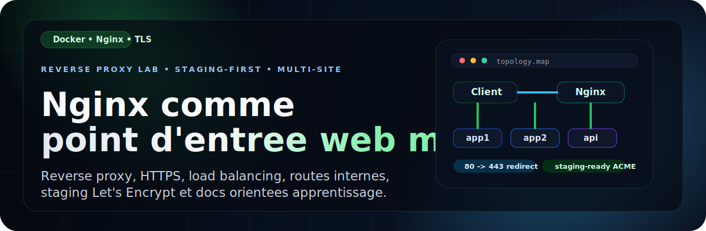
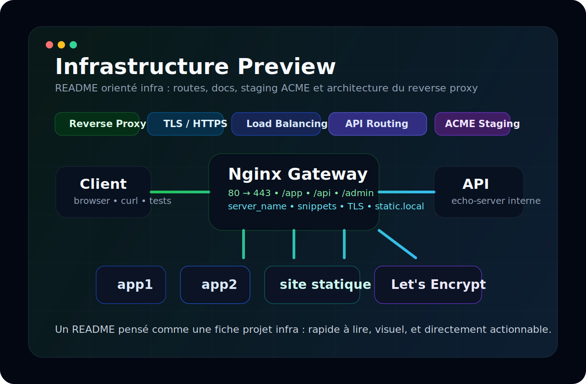

<div align="center">
  
</div>

<div align="center">

# Nginx Docker Lab

Une stack claire et premium pour apprendre Nginx comme reverse proxy avec Docker.

<p>
  
  
  
  
  
</p>

<p>
  <a href="/root/Nginx/docs/ARCHITECTURE.md">Architecture</a> •
  <a href="/root/Nginx/docs/NGINX-COURSE.md">Cours Nginx</a> •
  <a href="/root/Nginx/docs/PROD-STAGING.md">Prod / Staging</a> •
  <a href="/root/Nginx/docs/VPS-FROM-SCRATCH.md">VPS</a> •
  <a href="/root/Nginx/docs/DEBUG-LETSENCRYPT.md">Debug Let's Encrypt</a>
</p>

</div>

---

Un lab orienté infra pour comprendre les usages vraiment utiles de Nginx :

- terminaison TLS sur `443`
- redirection HTTP vers HTTPS
- reverse proxy vers une API interne
- load balancing entre plusieurs services
- multi-site avec `server_name`
- Basic Auth sur une zone sensible
- site statique secondaire
- workflow Let’s Encrypt en staging avant passage eventuel en prod

<div align="center">
  
</div>

## Vue rapide

### Ce que le projet montre

Nginx joue ici le role de porte d'entree unique. Le client parle a Nginx, puis Nginx decide s'il :

- sert un site statique
- redirige vers HTTPS
- transfere la requete vers un backend interne
- distribue la charge entre `app1` et `app2`
- protege un acces comme `/admin/`

### Routes utiles

- `https://nginx.local/` : site principal
- `https://nginx.local/app/` : backend load-balanced
- `https://nginx.local/api/` : API proxifiee
- `https://nginx.local/admin/` : zone protegee
- `https://static.local/` : second site
- `https://localhost:8443/` : variante locale du site secondaire

## Parcours de lecture

- Comprendre la topologie : [docs/ARCHITECTURE.md](/root/Nginx/docs/ARCHITECTURE.md:1)
- Lire le template Nginx presque ligne par ligne : [docs/NGINX-COURSE.md](/root/Nginx/docs/NGINX-COURSE.md:1)
- Comprendre le staging puis le passage possible en prod : [docs/PROD-STAGING.md](/root/Nginx/docs/PROD-STAGING.md:1)
- Deployer sur un serveur neuf : [docs/VPS-FROM-SCRATCH.md](/root/Nginx/docs/VPS-FROM-SCRATCH.md:1)
- Debloquer un souci ACME : [docs/DEBUG-LETSENCRYPT.md](/root/Nginx/docs/DEBUG-LETSENCRYPT.md:1)

## Demarrage rapide

### 1. Initialiser

```bash
chmod +x scripts/*.sh
make init-dev
```

Cette commande :

- cree `.env.dev` si besoin
- genere des certificats autosignes
- genere le fichier `.htpasswd`

Modele d'environnement :

- `.env.dev.example` -> `.env.dev`
- `.env.prod.example` -> `.env.prod`

### 2. Ajouter les entrees locales

Ajoute dans `/etc/hosts` :

```text
127.0.0.1 nginx.local
127.0.0.1 static.local
```

### 3. Lancer la stack

```bash
make up
```

### 4. Tester

```bash
curl -I -H "Host: nginx.local" http://127.0.0.1/
curl -k https://nginx.local/
curl -k https://nginx.local/app/
curl -k https://nginx.local/api/
curl -k -u admin:ChangeMeNow123! https://nginx.local/admin/
curl -k https://static.local/
curl -k https://localhost/
curl -k https://localhost:8443/
```

## Stack

```text
Client
  |
  v
Nginx reverse proxy
  |-- /           -> landing page
  |-- /app/       -> app1 + app2
  |-- /api/       -> api
  |-- /admin/     -> backend + Basic Auth
  `-- static.local -> site statique secondaire
```

## Fichiers importants

- [docker-compose.yml](/root/Nginx/docker-compose.yml:1) : services communs
- [docker-compose.dev.yml](/root/Nginx/docker-compose.dev.yml:1) : surcharge locale
- [docker-compose.prod.yml](/root/Nginx/docker-compose.prod.yml:1) : surcharge prod / staging
- [nginx/nginx.conf](/root/Nginx/nginx/nginx.conf:1) : configuration globale
- [nginx/templates/default.conf.template](/root/Nginx/nginx/templates/default.conf.template:1) : virtual hosts du mode dev
- [nginx/templates-prod/default.conf.template](/root/Nginx/nginx/templates-prod/default.conf.template:1) : virtual hosts du mode prod
- [nginx/snippets/proxy-common.conf](/root/Nginx/nginx/snippets/proxy-common.conf:1) : headers proxy communs

## Commandes utiles

```bash
make up
make down
make logs
make validate
make test
make up-prod
make le-prod
make le-renew-prod
```

## Documentation officielle

- Nginx Reverse Proxy: https://docs.nginx.com/nginx/admin-guide/web-server/reverse-proxy/
- Nginx Load Balancing: https://docs.nginx.com/nginx/admin-guide/load-balancer/http-load-balancer/
- Nginx Beginner's Guide: https://nginx.org/en/docs/beginners_guide.html
- Nginx Admin Guide: https://docs.nginx.com/nginx/admin-guide/
- Let's Encrypt Staging Environment: https://letsencrypt.org/docs/staging-environment/
- Let's Encrypt Challenge Types: https://letsencrypt.org/docs/challenge-types/
- Certbot: https://certbot.eff.org/
