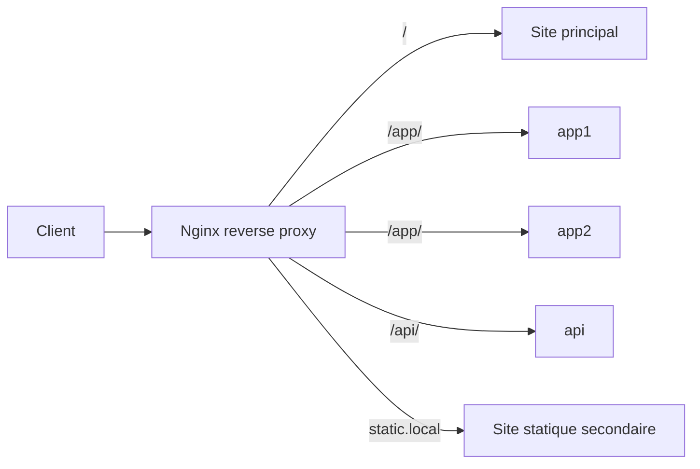

# Nginx Docker Lab

Une stack simple et complete pour apprendre les usages essentiels de Nginx en reverse proxy avec Docker.

## Ce que montre ce projet

Ce lab se concentre sur les usages les plus utiles de Nginx dans un contexte realiste :

- terminaison TLS sur `443`
- redirection HTTP vers HTTPS
- reverse proxy vers une API interne
- load balancing entre plusieurs services
- hebergement de plusieurs sites avec des `server_name`
- protection d'une zone avec Basic Auth
- service de contenu statique
- quelques bonnes pratiques de securite et de logs

## Qu'est-ce qu'un reverse proxy

Un reverse proxy est un serveur place devant une ou plusieurs applications.

Le client ne parle qu'a Nginx.
Ensuite, Nginx decide :

- s'il repond lui-meme avec un fichier statique
- s'il redirige vers HTTPS
- s'il transmet la requete a un backend interne
- s'il distribue la charge entre plusieurs backends
- s'il bloque, limite ou protege l'acces

Autrement dit, Nginx devient la porte d'entree unique du systeme web.

## Comment une requete circule

Exemple avec `https://nginx.local/api/` :

1. le navigateur envoie une requete a Nginx
2. Nginx regarde le `server_name` pour choisir le bon site
3. Nginx regarde la `location` pour choisir la bonne regle
4. la `location /api/` envoie la requete vers le service Docker `api`
5. le service repond a Nginx
6. Nginx renvoie la reponse au client

Ce mecanisme permet de garder les services internes invisibles depuis l'exterieur.

## Usages principaux d'un reverse proxy Nginx

### 1. Centraliser l'entree web

Nginx recoit toutes les requetes entrantes puis decide quoi faire selon le domaine, le port ou le chemin demande.

Exemples dans ce projet :

- `https://nginx.local/` sert le site principal
- `https://nginx.local/app/` envoie la requete vers un cluster applicatif
- `https://nginx.local/api/` envoie la requete vers une API interne
- `https://static.local/` sert un second site statique

### 2. Cacher l'infrastructure interne

Les services `app1`, `app2` et `api` ne sont pas exposes publiquement. Seul Nginx est publie. Cela simplifie la securite et l'exploitation.

### 3. Gerer HTTPS

Nginx porte les certificats, negocie TLS et peut rediriger automatiquement le trafic HTTP vers HTTPS.

### 4. Faire du routage applicatif

Nginx peut router par domaine ou par chemin :

- routage par domaine avec `nginx.local` et `static.local`
- routage par chemin avec `/app/`, `/api/` et `/admin/`

### 5. Equilibrer la charge

Dans ce lab, Nginx distribue les requetes du chemin `/app/` entre `app1` et `app2`.

### 6. Ajouter une couche de securite

Nginx applique ici :

- des en-tetes de securite
- le masquage de version
- une zone protegee par mot de passe sur `/admin/`

## A quoi sert Nginx dans un projet reel

Dans un projet concret, Nginx est souvent utilise pour :

- exposer une seule adresse publique devant plusieurs applications
- terminer TLS pour eviter de gerer les certificats dans chaque service
- router une application web et une API depuis un meme domaine
- proteger des routes sensibles comme `/admin/`
- absorber une partie de la charge grace au cache et au load balancing
- standardiser les logs, headers et regles de securite

## Architecture

Schema detaille : [docs/ARCHITECTURE.md](/root/Nginx/docs/ARCHITECTURE.md:1)



## Arborescence utile

```text
.
|-- docker-compose.yml
|-- docker-compose.dev.yml
|-- docker-compose.prod.yml
|-- Makefile
|-- .env.dev.example
|-- .env.prod.example
|-- docs/
|   `-- ARCHITECTURE.md
|-- nginx/
|   |-- nginx.conf
|   |-- snippets/
|   `-- templates/
|-- scripts/
`-- sites/
    |-- landing/
    `-- static/
```

## Demarrage rapide

### 1. Initialiser

```bash
chmod +x scripts/*.sh
make init-dev
```

Cette commande :

- cree `.env.dev` si besoin
- genere des certificats autosignes
- genere le fichier `.htpasswd` pour `/admin/`

Pour la partie production/staging, le modele est :

- `.env.dev.example` -> `.env.dev`
- `.env.prod.example` -> `.env.prod`

Le depot ne garde plus de `.env` generique pour eviter les doublons.

### 2. Ajouter les entrees locales

Ajoutez dans `/etc/hosts` :

```text
127.0.0.1 nginx.local
127.0.0.1 static.local
```

### 3. Lancer la stack

```bash
make up
```

### 4. Tester

```bash
curl -I -H "Host: nginx.local" http://127.0.0.1/
curl -k https://nginx.local/
curl -k https://nginx.local/app/
curl -k https://nginx.local/api/
curl -k -u admin:ChangeMeNow123! https://nginx.local/admin/
curl -k https://static.local/
curl -k https://localhost/
curl -k https://localhost:8443/
```

## Comment Nginx est utilise ici

### Site principal

Le site principal est servi directement par Nginx depuis `sites/landing/`.

### Reverse proxy vers une API

Le chemin `/api/` est transmis au service `api` sur le reseau interne Docker.

### Load balancing

Le chemin `/app/` utilise l'upstream `app_cluster`, compose de `app1` et `app2`.

### Zone protegee

Le chemin `/admin/` exige une authentification Basic Auth avant de relayer vers le backend.

### Multi-site

Un second bloc `server` repond pour `static.local` et sert le contenu de `sites/static/`.

## Lecture guidee de la configuration Nginx

Le fichier le plus important pour comprendre ce lab est
[nginx/templates/default.conf.template](/root/Nginx/nginx/templates/default.conf.template:1).

Voici les blocs a retenir :

### `upstream app_cluster`

Ce bloc declare plusieurs serveurs backend :

- `app1`
- `app2`

Nginx peut ensuite utiliser le nom logique `app_cluster` pour repartir les requetes entre eux.

### `server`

Un bloc `server` represente un site ou un hote virtuel.

Dans ce projet, on a par exemple :

- un `server` HTTP pour rediriger vers HTTPS
- un `server` HTTPS pour `nginx.local`
- un `server` HTTPS pour `static.local`

### `location`

Un bloc `location` dit a Nginx quoi faire pour un chemin donne.

Exemples :

- `location /` : sert le site principal
- `location /app/` : proxy vers `app_cluster`
- `location /api/` : proxy vers `api`
- `location /admin/` : meme principe, avec authentification

### `proxy_pass`

`proxy_pass` est la directive qui transforme Nginx en reverse proxy.

Exemples dans ce lab :

- `proxy_pass http://app_cluster/;`
- `proxy_pass http://api/;`

### `proxy_set_header`

Les directives du snippet
[nginx/snippets/proxy-common.conf](/root/Nginx/nginx/snippets/proxy-common.conf:1)
transmettent au backend des informations utiles :

- le host original
- l'adresse IP du client
- le protocole d'origine
- les en-tetes `X-Forwarded-*`

Cela permet a l'application backend de savoir comment la requete est arrivee.

## Mini lecture ligne par ligne

Extrait simplifie :

```nginx
location /api/ {
    include /etc/nginx/snippets/proxy-common.conf;
    limit_req zone=api_rate_limit burst=20 nodelay;
    proxy_pass http://api/;
}
```

Explication :

- `location /api/` : cette regle s'applique a toutes les requetes commencant par `/api/`
- `include ...proxy-common.conf` : on charge les headers proxy communs
- `limit_req ...` : on applique une limite de debit sur cette route
- `proxy_pass http://api/;` : la requete est envoyee au service `api`

## Fichiers a connaitre

- [docker-compose.yml](/root/Nginx/docker-compose.yml:1) : definition des services
- [docker-compose.dev.yml](/root/Nginx/docker-compose.dev.yml:1) : options locales de developpement
- [docker-compose.prod.yml](/root/Nginx/docker-compose.prod.yml:1) : surcharge production
- [nginx/nginx.conf](/root/Nginx/nginx/nginx.conf:1) : configuration globale Nginx
- [nginx/templates/default.conf.template](/root/Nginx/nginx/templates/default.conf.template:1) : virtual hosts du mode dev
- [nginx/templates-prod/default.conf.template](/root/Nginx/nginx/templates-prod/default.conf.template:1) : virtual hosts du mode prod
- [nginx/snippets/proxy-common.conf](/root/Nginx/nginx/snippets/proxy-common.conf:1) : headers communs pour les backends
- [docs/NGINX-COURSE.md](/root/Nginx/docs/NGINX-COURSE.md:1) : explication pas a pas du template Nginx
- [docs/PROD-STAGING.md](/root/Nginx/docs/PROD-STAGING.md:1) : guide staging puis passage eventuel en prod

## Commandes utiles

```bash
make up
make down
make logs
make validate
make test
```

## Documentation officielle

- Nginx Reverse Proxy: https://docs.nginx.com/nginx/admin-guide/web-server/reverse-proxy/
- Nginx Load Balancing: https://docs.nginx.com/nginx/admin-guide/load-balancer/http-load-balancer/
- Nginx Beginner's Guide: https://nginx.org/en/docs/beginners_guide.html
- Nginx Admin Guide: https://docs.nginx.com/nginx/admin-guide/
- Let's Encrypt Staging Environment: https://letsencrypt.org/docs/staging-environment/
- Let's Encrypt Challenge Types: https://letsencrypt.org/docs/challenge-types/
- Certbot: https://certbot.eff.org/

## Suite possible

Cette base est volontairement simple. On pourra ensuite l'ameliorer avec :

- Let's Encrypt
- cache proxy plus avance
- rate limiting plus strict
- headers et hardening supplementaires
- CI de validation Nginx
- une doc dediee aux directives Nginx essentielles
