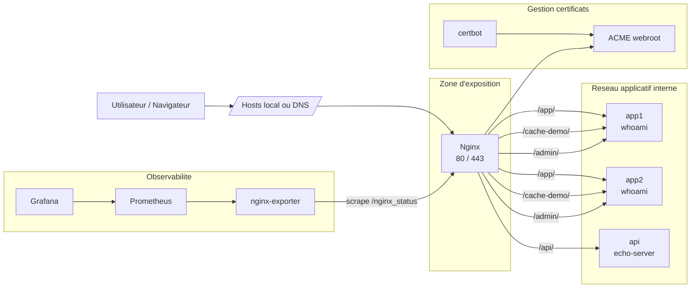

# Architecture Nginx Docker Lab

## Vue d'ensemble

Ce document donne une lecture rapide et professionnelle de l'architecture du projet.

## Schema logique

## Reseaux Docker

Le projet separe les flux en trois reseaux :

- `edge` : reseau d'exposition pour Nginx et Certbot
- `app_net` : reseau interne pour les backends applicatifs
- `obs_net` : reseau interne pour la supervision

## Flux principaux

### Flux web

1. Le client atteint `nginx.local` ou `static.local`
2. Nginx ecoute sur `80` et `443`
3. HTTP est redirige vers HTTPS
4. Nginx sert soit un site statique, soit reverse-proxy les requetes vers un backend

### Flux applicatif

- `/app/` : load balancing vers `app1` et `app2`
- `/api/` : proxy vers `api`
- `/cache-demo/` : meme upstream, avec cache Nginx actif
- `/admin/` : meme upstream, avec Basic Auth

### Flux observabilite

1. `nginx-exporter` lit `/nginx_status`
2. `Prometheus` scrape `nginx-exporter`
3. `Grafana` interroge `Prometheus`

## Durcissement ajoute

Les conteneurs sont renforces avec :

- `read_only: true` quand c'est compatible
- `no-new-privileges`
- `cap_drop: ALL`
- `tmpfs` pour les ecritures temporaires
- reseaux internes pour les services non exposes

## Evolutions recommandees

- certificats Let's Encrypt automatises
- gestion des secrets hors `.env`
- CI/CD avec tests de configuration
- supervision des logs et alerting
