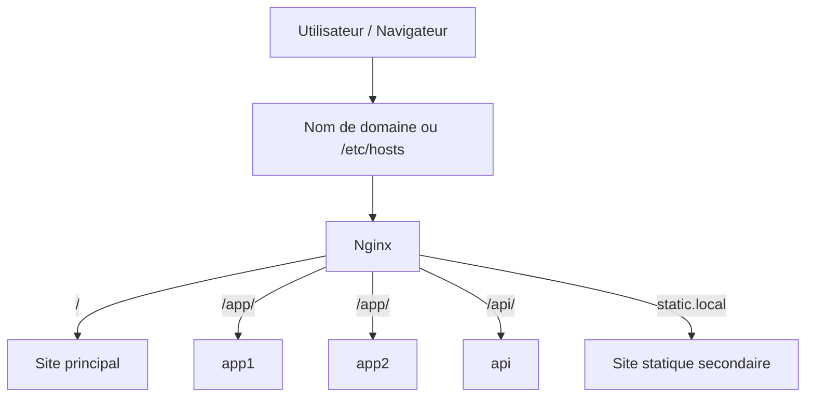
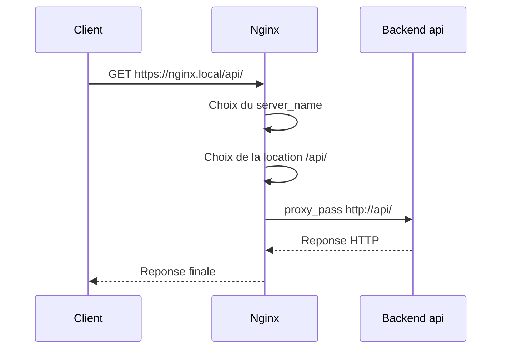

# Architecture Nginx Docker Lab

## Vue d'ensemble

Cette architecture montre un usage classique de Nginx comme point d'entree unique devant plusieurs services internes.

Le but est de comprendre tres vite qui parle a qui, et pourquoi Nginx est place au centre.

## Schema logique

## Schema de parcours d'une requete

## Composants

### Nginx

Point d'entree unique expose sur l'hote.

Responsabilites :

- recevoir les requetes HTTP et HTTPS
- rediriger HTTP vers HTTPS
- router selon le domaine ou le chemin
- servir du contenu statique
- proxyfier les requetes vers les services internes
- proteger certaines routes

En pratique, c'est le seul service visible par le client.

### app1 et app2

Deux services de demonstration utilises pour illustrer le load balancing.

### api

Service HTTP interne utilise pour montrer le reverse proxy vers une API.

### landing et static

Deux sites statiques servis par Nginx.

## Flux principaux

### 1. Arrivee du trafic

Le client appelle `nginx.local` ou `static.local`. Nginx est le seul service expose au reseau externe.

### 2. Redirection HTTPS

Les requetes arrivees sur `80` sont redirigees vers `443`.

### 3. Routage

Nginx route ensuite selon le contexte :

- `/` vers le site principal
- `/app/` vers `app1` et `app2`
- `/api/` vers `api`
- `/admin/` vers le backend avec Basic Auth
- `static.local` vers le site statique secondaire

## Lecture simple des decisions Nginx

Quand Nginx recoit une requete, il suit en general cette logique :

1. il regarde le port d'arrivee, par exemple `80` ou `443`
2. il cherche le bon `server` grace au domaine demande
3. il cherche la bonne `location` grace au chemin demande
4. il sert un fichier local ou fait un `proxy_pass`

Cette grille de lecture est souvent la plus simple pour comprendre un fichier Nginx.

## Reseaux Docker

Le projet utilise deux reseaux :

- `edge` : reseau de facade sur lequel Nginx est expose
- `app_net` : reseau interne reserve aux backends

Cela permet de ne pas exposer directement les services applicatifs.

## Lecture pratique du reverse proxy

Quand une requete arrive :

1. le client contacte Nginx
2. Nginx identifie le bon bloc `server`
3. Nginx choisit la bonne `location`
4. Nginx sert un fichier statique ou relaie la requete vers un upstream
5. la reponse revient au client via Nginx

## Bonnes pratiques visibles dans ce lab

- un point d'entree unique
- des backends non publies
- HTTPS active
- snippets reutilisables pour le proxy
- fichiers de configuration separes entre dev et prod
- authentification simple sur une zone sensible

## Resume pedagogique

Si on devait resumer ce projet en une phrase :

Nginx recoit toutes les requetes, decide de la bonne destination, puis sert le contenu lui-meme ou relaie vers le bon service interne.
